# Hello DES INV 202 Student!
Welcome to your new GitHub repository! 

# Outline
[week 1](README.md#week-1-example-report-1)

week 2, etc...

---

# Github Background Information & Context
If you’re new to GitHub, you can think of this as a shared file space (like a Google Drive folder, or a like a USB drive that’s hosted online.) 

This is your space to store project files, videos, PDFs, notes, images, etc., and (hopefully, neatly) organize so it's easy for viewers (and you!) to navigate. That said, it’s super easy for you to share any file or folder with us (your TDF instructional team) - just send us the link!  As a start, feel free to simply add images to the `/assets` folder, which is located [here](/assets). 

The specific file that I’m typing into right now is the **README.md** for this repo. 
##### (💡 TIP: The .md indicates that we’re using [Markdown formatting.](https://www.markdownguide.org/cheat-sheet/)) #####
<h6> (💡 TIP 2: GitHub Markdown supports <a href="https://gist.github.com/seanh/13a93686bf4c2cb16e658b3cf96807f2"> <em>HTML formatting</em> too, including emojis 😄</a>, in case that helps!) </h6>

### :star: Whatever you write in your **README.md** will show up on the “front page” of your GitHub repo. This is where we’ll be looking for your [weekly progress reports](https://github.com/Berkeley-MDes/24f-desinv-202/wiki/3.0-Weekly-Submissions#weekly-progress-report). They might look something like this: ###

# Week 1: Report 1 #
## Week of 09/05/2024

This week, I took a class on immersive technology, and it reminded me of the movie READY PLAYER ONE, which I really enjoyed, it also brought back memories of the Disney designed floors-HoloTile Floor, that I had seen before, which are very important for the development of future virtual reality games.

---

# Week 2: Report 1 #
## Week of 09/09/2024
I just want to try the grasshopper, as I never used it before.

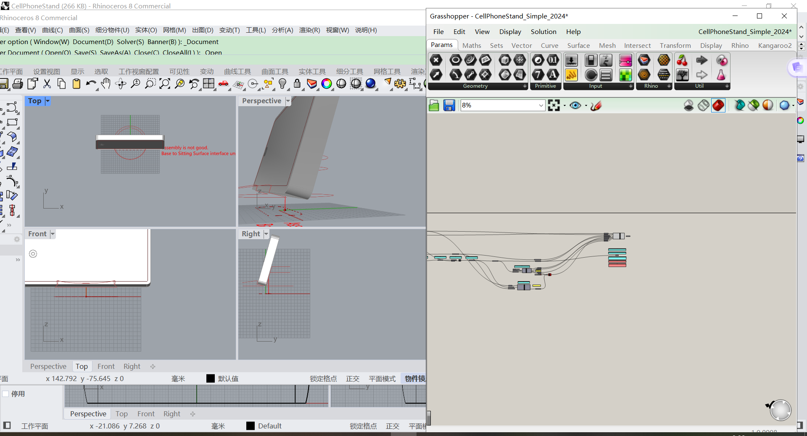

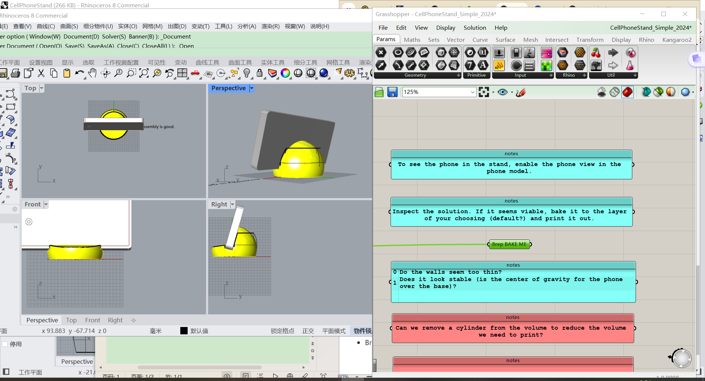

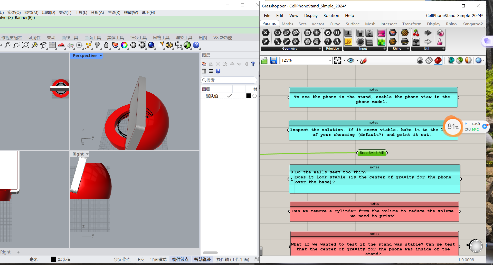

I hope the phone stand I design can be unique and highly desirable, so I would like its shape to be inspired by some beautiful creatures. 
I first thought of an octopus, with its many tentacles that could be used to support the phone. 

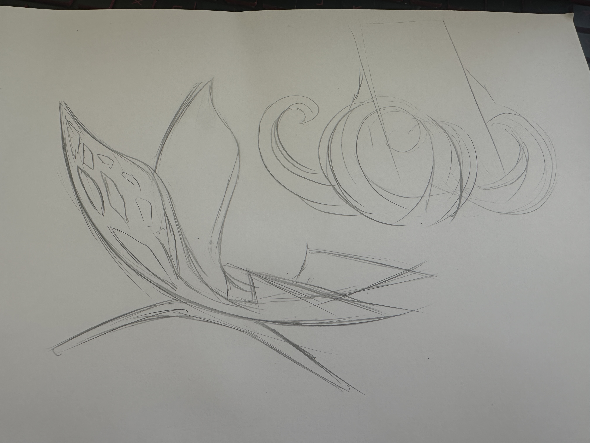

I used MidJourney to generate a similar image. Although it’s not very detailed, it captures exactly the feeling I’m going for.

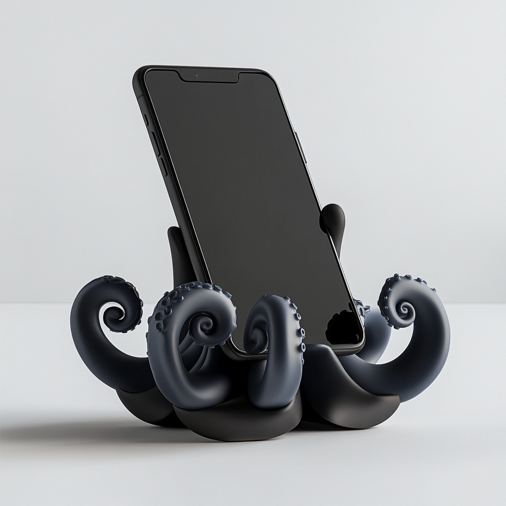

And I also think of the fragile and beautiful creature, butterfly, it inspired me.

but it seems not that good now, I need to improve it to make it become a cell phone stand, simplify the lines of two wings and make its feet and body to support teh object.

And what I think about is that no matter what kind of creature I want to imitate, the phone stand will be full of curve surfaces, but with Rhino the design process will be very complicated, so I just think about which modeling tool I should choose, maybe Nomad? Is that ok for the class?

Well, I finally understand the meaning of the class, I guess I can't use nomad or blender, so I just want to try to learn the grasshopper, I hope everything will be ok.
My learning process!

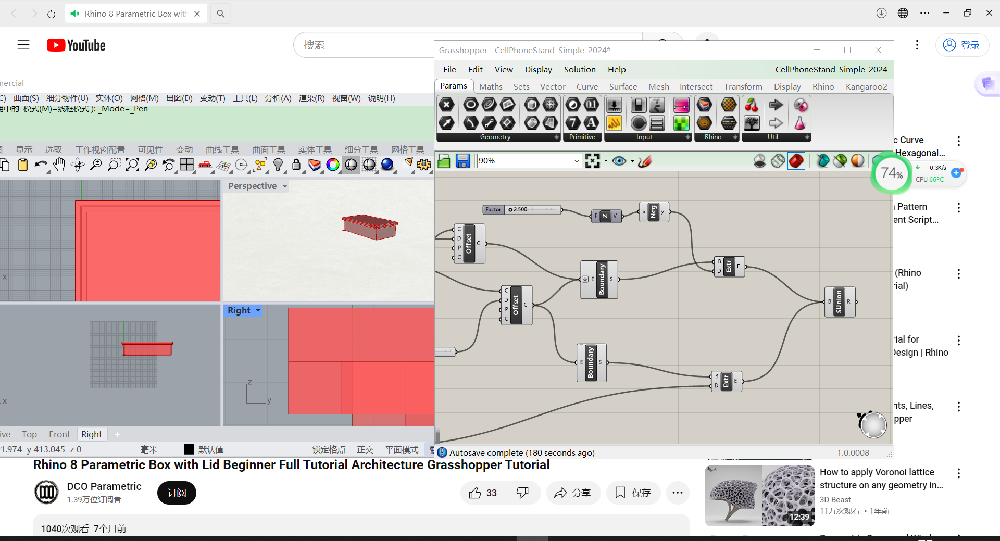  build

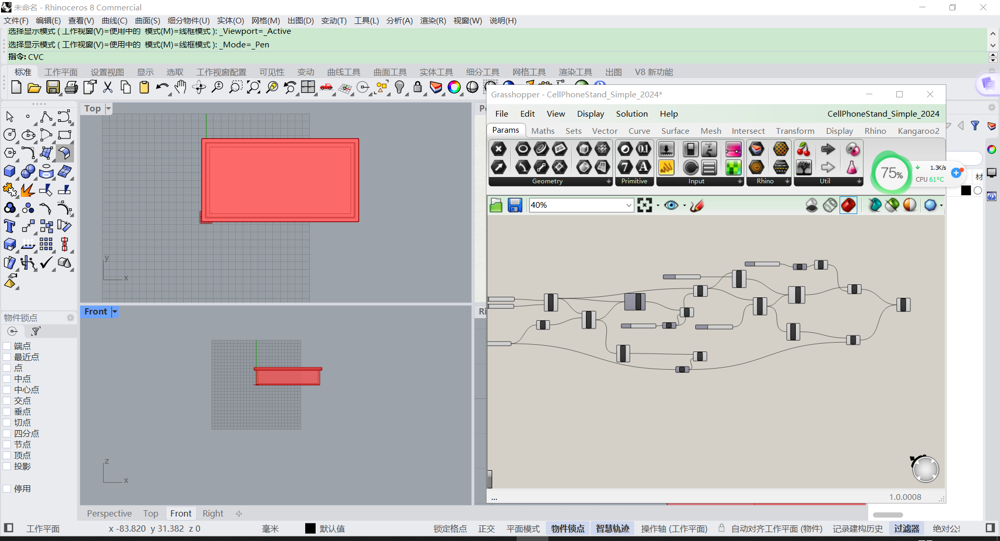

I still want to build a cell phone stand, but it will be much more simple, there is not curve surface in it because it's difficult in grasshopper. 

I want a triangular mobile phone stand, use the inclined surface to support my phone.

I don't like grasshopper actually, it makes me feel uncomfortable, but I still try it.

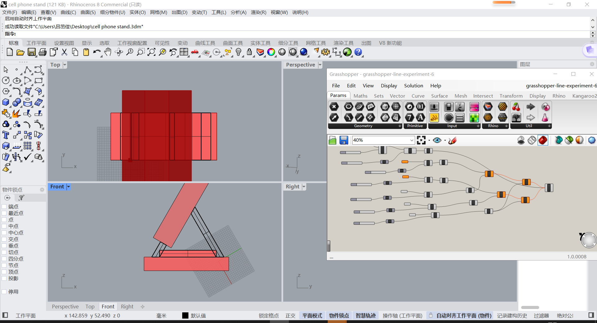

And I will use 3D printing to produce the cell phone stand.

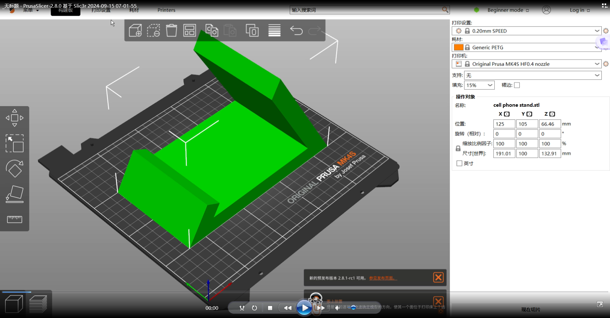

I hope everything will be ok!

# Week 3: Report 3 #
## Week of 09/16/2024

I used a 3D printer to print out my phone stand.I think the process of 3D printing is interesting, I think I want to try more in the future.

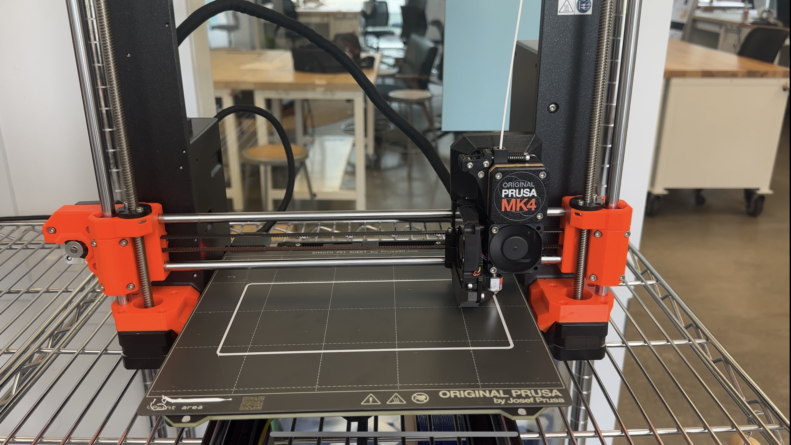

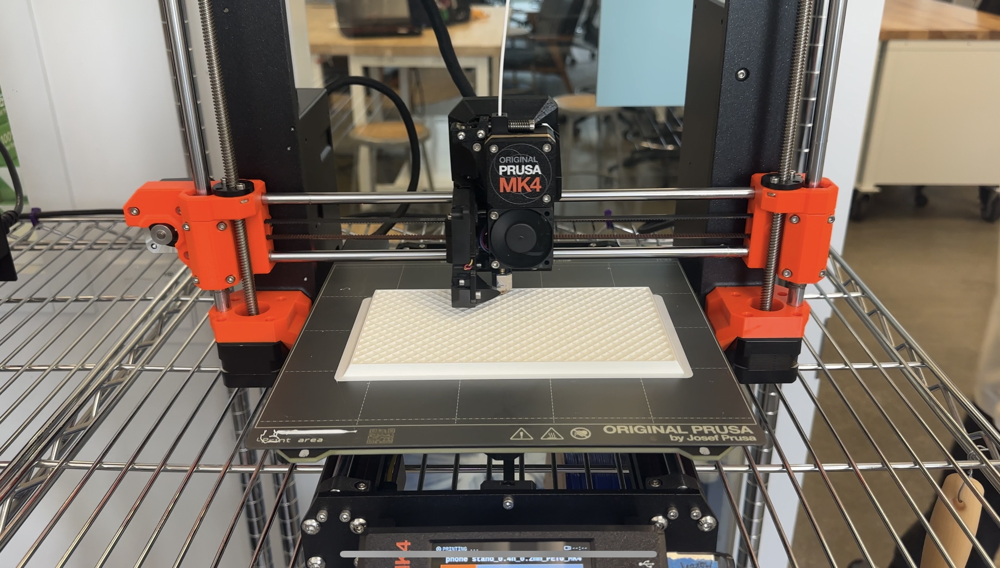

When you actually use this object in real life, that’s when you can truly feel its advantages and disadvantages.

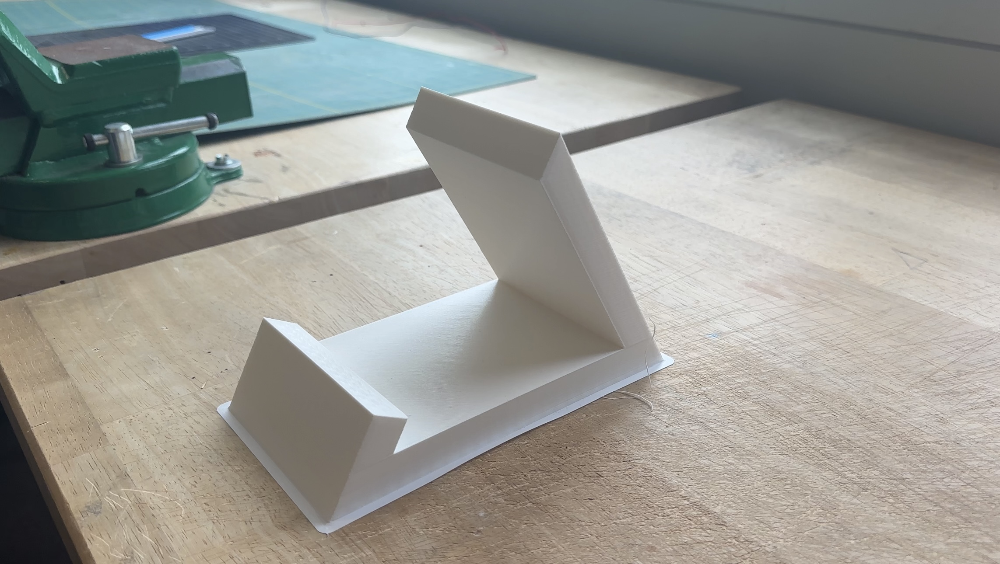

I used this product myself and also had my classmates try it out and give their feedback.

They think the edge of the object is to sharp and it may hurt people, I think so, people have to use it carefully!

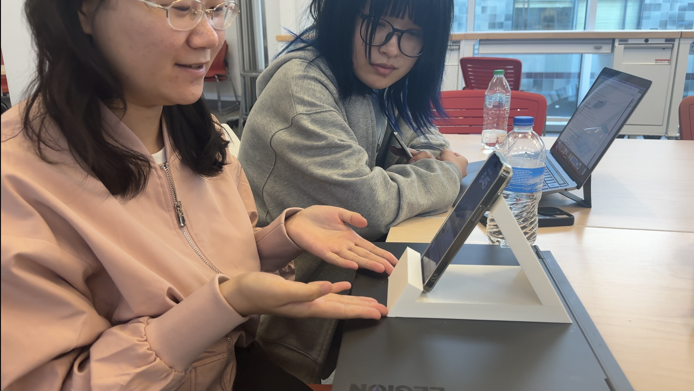

After I think of the feedbacks from my classmates, I polished the edges of the product, making them less sharp, I always want to make my product much more better.

Well tomorrow we have to submit the video, I will show the process of using grasshopper to build this object and how I print it and what my friend think about it in the video.

## Quick Links, compiled here for your convenience: ##

- [TDF Wiki](https://github.com/Berkeley-MDes/24f-desinv-202/wiki) - the ultimate source for truth and information about the course and assignments
- [Google Drive Folder](https://drive.google.com/drive/u/0/folders/1DJ1b6sSDwHXX6NRcQYt10ivyQSgU0ND6) - slides and other resources
- [bCourses](https://bcourses.berkeley.edu/courses/1537533) - where the grading happens
