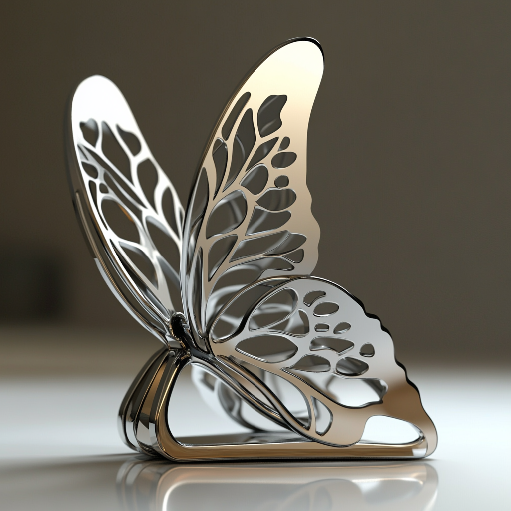
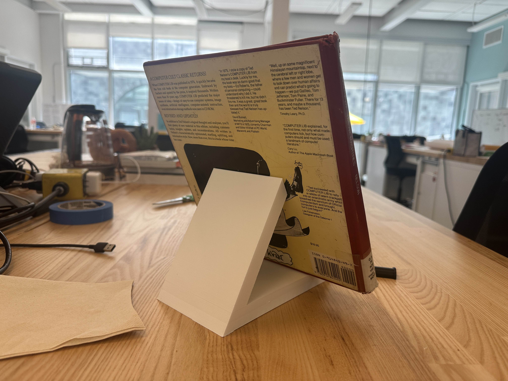
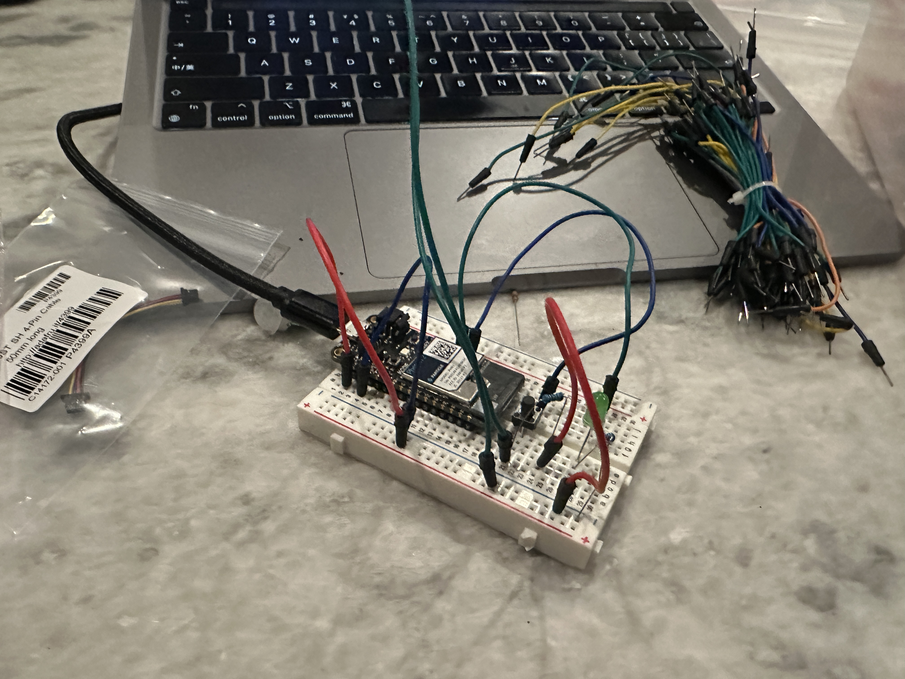
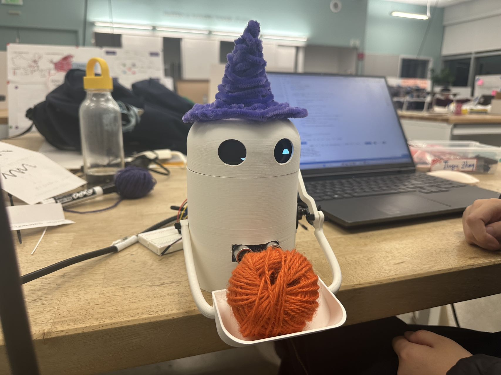
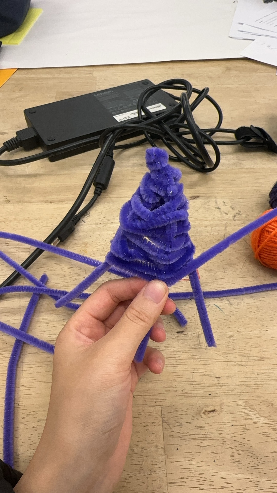

# Hello DES INV 202 Student!
Welcome to your new GitHub repository! 

# Outline
[week 1](README.md#week-1-example-report-1)

week 2, etc...

---

# Github Background Information & Context
If you’re new to GitHub, you can think of this as a shared file space (like a Google Drive folder, or a like a USB drive that’s hosted online.) 

This is your space to store project files, videos, PDFs, notes, images, etc., and (hopefully, neatly) organize so it's easy for viewers (and you!) to navigate. That said, it’s super easy for you to share any file or folder with us (your TDF instructional team) - just send us the link!  As a start, feel free to simply add images to the `/assets` folder, which is located [here](/assets). 

The specific file that I’m typing into right now is the **README.md** for this repo. 
##### (💡 TIP: The .md indicates that we’re using [Markdown formatting.](https://www.markdownguide.org/cheat-sheet/)) #####
<h6> (💡 TIP 2: GitHub Markdown supports <a href="https://gist.github.com/seanh/13a93686bf4c2cb16e658b3cf96807f2"> <em>HTML formatting</em> too, including emojis 😄</a>, in case that helps!) </h6>

### :star: Whatever you write in your **README.md** will show up on the “front page” of your GitHub repo. This is where we’ll be looking for your [weekly progress reports](https://github.com/Berkeley-MDes/24f-desinv-202/wiki/3.0-Weekly-Submissions#weekly-progress-report). They might look something like this: ###

# Week 1: Report 1 #
## Week of 09/05/2024

This week, I took a class on immersive technology, and it reminded me of the movie READY PLAYER ONE, which I really enjoyed, it also brought back memories of the Disney designed floors-HoloTile Floor, that I had seen before, which are very important for the development of future virtual reality games.

---

# Week 2: Report 1 #
## Week of 09/09/2024
I just want to try the grasshopper, as I never used it before.

I hope the phone stand I design can be unique and highly desirable, so I would like its shape to be inspired by some beautiful creatures. 
I first thought of an octopus, with its many tentacles that could be used to support the phone. 

I used MidJourney to generate a similar image. Although it’s not very detailed, it captures exactly the feeling I’m going for.

And I also think of the fragile and beautiful creature, butterfly, it inspired me.

but it seems not that good now, I need to improve it to make it become a cell phone stand, simplify the lines of two wings and make its feet and body to support teh object.

And what I think about is that no matter what kind of creature I want to imitate, the phone stand will be full of curve surfaces, but with Rhino the design process will be very complicated, so I just think about which modeling tool I should choose, maybe Nomad? Is that ok for the class?

Well, I finally understand the meaning of the class, I guess I can't use nomad or blender, so I just want to try to learn the grasshopper, I hope everything will be ok.
My learning process!

  build

I still want to build a cell phone stand, but it will be much more simple, there is not curve surface in it because it's difficult in grasshopper. 

I want a triangular mobile phone stand, use the inclined surface to support my phone.

I don't like grasshopper actually, it makes me feel uncomfortable, but I still try it.

And I will use 3D printing to produce the cell phone stand.

I hope everything will be ok!

# Week 3: Report 3 #
## Week of 09/16/2024

I used a 3D printer to print out my phone stand.I think the process of 3D printing is interesting, I think I want to try more in the future.

When you actually use this object in real life, that’s when you can truly feel its advantages and disadvantages.

I used this product myself and also had my classmates try it out and give their feedback.

They think the edge of the object is to sharp and it may hurt people, I think so, people have to use it carefully!

After I think of the feedbacks from my classmates, I polished the edges of the product, making them less sharp, I always want to make my product much more better.

And now I find a better way to use the product! It can be a good place to show books!

Well tomorrow we have to submit the video, I will show the process of using grasshopper to build this object and how I print it and what my friend think about it in the video.

This is my video address:https://youtu.be/JOZMqHVANZ8

Regarding the voiceover for the video, what I want to say is that I’ve had a cold this week. I think I’m still getting used to Berkeley’s weather, and my physical condition is quite poor, so I don’t feel like speaking. I’ve done my best to finish the video, ensuring that every step looks clear and complete.

I hope I can win the Axolotl grade, cause I think I already try my best, I know nothing about grasshopper before, and I never try to print something by myself, and I improve the project with feedback, so I think I can get a better grade.

# Week 4: Report 4 #
## Week of 09/23/2024
Overview

This diagram illustrates the flow of data in an Entertainment and Media Ecosystem, showing how users interact with devices and platforms, how content is retrieved, and how user data is used for personalized recommendations and advertisements.

Key Components

	1.	User: Interacts with devices to request content (e.g., movies, music).
	2.	Devices: Facilitate user interaction with platforms.
	3.	Platform: Processes user requests and retrieves content from the Content Library.
	4.	User Preferences: Stores user behavior data (viewing history, likes) for analysis.
	5.	Behavioral Analysis: Analyzes user data to generate personalized recommendations.
	6.	Ad Delivery: Sends personalized ads to the user based on behavior analysis.

Data Flows

	•	Content Request: User → Device → Platform → Content Library.
	•	Content Delivery: Content Library → Platform → Device.
	•	Behavior Data: User interactions are stored in User Preferences.
	•	Ad Transmission: Personalized ads are generated and sent to the user’s device.

## Quick Links, compiled here for your convenience: ##

# Week 5: Report 5 #
## Week of 10/03/2024
I think my task is to ycomplete three tutorial projects and, learn how to build circuits and maybe how to write code?
Actually I have nno idea about the assignment cause even though I have learnt something about Arduino before, I forgot everything very fast, so now I only know something about how to build the circuits.
However, I followed the tutorial step by step, and whenever I encountered something I didn’t understand, I asked ChatGPT, and I managed to complete the tasks step by step. 

I finished three projects: HelloWorld, Make it Blink, and RGB_led_fade. 

To be honest, there were many unexpected issues along the way. For example, I discovered that my device was constantly offline when I was working from home, and I was really confused about that. It wasn’t until I consulted ChatGPT that I realized the issue was with the WiFi.

Firstly, when I was setting up the circuit, I noticed that the schematic provided by the professor didn’t match the actual situation—our button had only two connection points. But since I had worked with Arduino before, this wasn’t a big issue for me. 

Also, I found that the blinking frequency of the LED didn’t increase when I pressed the button, which was due to an issue with the change_period() function. To be honest, I didn’t experience any ‘Ah-ha!’ moments during the debugging process because, with ChatGPT’s help, all of my confusions were resolved almost immediately.

# Week 6: Report 6 #
## Week of 10/07/2024

I successfully soldered the Stemma QT interface board following the demonstration video.

Experiment Process:
I used the MPU6050 accelerometer and gyroscope for the experiment. In the setup() function, I initialized the sensor and successfully displayed data in the serial monitor.
In the loop() function, I read the accelerometer and gyroscope data every 500 milliseconds and printed it to the serial monitor.

Possible Modifications:
1.Used the map() function to map sensor data to control the LED output.
2.Applied constrain() to limit data range or used a simple smoothing algorithm to filter noisy data.

Conclusion:
I successfully completed the sensor connection, data reading, and logging. I also experimented with data mapping and smoothing techniques.
This experiment helped me understand how to interact with Stemma sensors using a Particle device.

# Week 7: Report 7 #
## Week of 10/17/2024

1. Progress and Achievements
In the past week, we gained inspiration and finalized the idea of designing a trash bin robot. This concept excited me, and I quickly moved on to planning how to model the trash bin structure. My goal is to build a functional prototype and eventually 3D print the model for further iteration.

2. Challenges Faced
As I started modeling the robot, I realized that the structure is much more complex than I initially expected. One of the biggest challenges is the connection between different parts—this aspect is particularly tricky for me since it’s not my area of expertise. Managing the mechanical aspects of part assembly has proven to be quite a headache.

3. Plan Moving Forward
To avoid being overwhelmed by the complexity, I decided to start with the outer shell of the robot. Once I have the shell ready, I will gradually tackle the interior components and connections step by step. This phased approach will help me stay organized and focused, ensuring that the prototype can be built systematically.

# Week 8: Report 8 #
## Week of 10/24/2024

This week, we completed our smart trash bin robot, and I think it’s super cute. We spent a lot of time building it. My main responsibilities were model construction, 3D printing, and hands-on assembly. Of course, I was also involved in some technical aspects, such as the expression feedback feature.

We also spent a lot of time thinking its appearance, we want to make it cute.

This little robot has a variety of expressions: it gets angry when the trash is full, feels sad when you knock it over, and becomes happy again when you help it up.

We have done a lot of work this week, so we finally chose the Axolot project challenge level, we think we deserve it!

# Week 9: Report 9 #
## Week of 10/31/2024

This week, I completed the basic framework for the system architecture, including connections between the knowledge base, ZeroWidth platform, and LLM generation module. Seeing each component take shape really gave me a clearer sense of direction.

I ran the first basic experiment, testing different parameter combinations, like the basic GPT setup and some initial instructions, to observe how the model responds. This helped me get a preliminary feel for the model’s behavior.

And I organized the content for the knowledge base, selecting essential information that the model needs for its responses. This process gave me a clearer understanding of what kind of knowledge the model relies on.

# Week 10: Report 10 #
## Week of 11/07/2024

This week, I integrated the RAG framework into the model, which improved the precision of knowledge retrieval and significantly enhanced response relevance.

I added some variables, like temperature and contextual parameters, to make the model’s responses more flexible and able to adapt automatically to different scenarios.

With the setup of instructions, RAG, and variables, I finally completed the final experiment. Now, the model can generate highly personalized responses across various scenarios, making it feel like I’m one step closer to the goal.

# Week 11: Report 11 #
## Week of 11/14/2024

This week, I officially joined a team for the final project. At first, we didn’t have a clear idea of what to work on, but after several discussions, we developed a very rough concept. The team is exploring the idea of a wearable device that can visualize emotional states through technology and design. While still in its infancy, this concept has given us a starting point to brainstorm further and identify potential directions.

Challenges:
Aligning diverse ideas within the team and shaping them into a coherent concept has been a key challenge this week.

Next Steps:
1. Continue refining the initial concept and defining the key features of the project.
2.Explore technical feasibility and start gathering resources for development.

- [TDF Wiki](https://github.com/Berkeley-MDes/24f-desinv-202/wiki) - the ultimate source for truth and information about the course and assignments
- [Google Drive Folder](https://drive.google.com/drive/u/0/folders/1DJ1b6sSDwHXX6NRcQYt10ivyQSgU0ND6) - slides and other resources
- [bCourses](https://bcourses.berkeley.edu/courses/1537533) - where the grading happens
